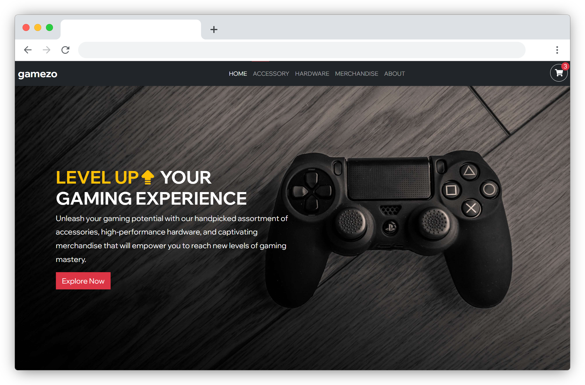
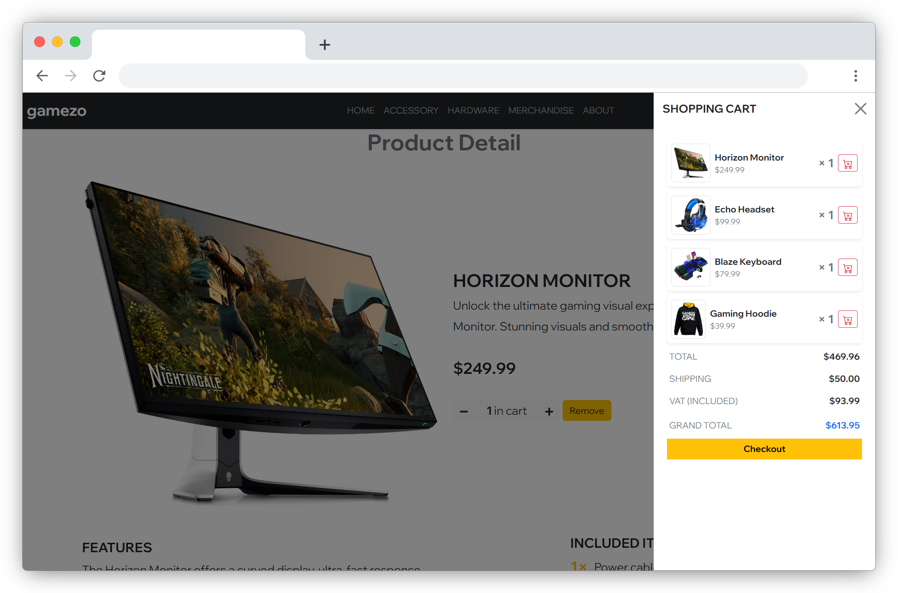

<a name="readme-top"></a>
[](https://github.com/IndieCoderMM/loot-market/graphs/contributors)
[](https://github.com/IndieCoderMM/loot-market/commits/main)
[](https://github.com/IndieCoderMM/loot-market/stargazers)
[](https://github.com/IndieCoderMM/loot-market/issues)
[](https://github.com/IndieCoderMM/loot-market/blob/main/LICENSE)

<details>
<summary>Table of Contents</summary>

- [🎮 Gamezon - E-commerce Website ](#-gamezon---e-commerce-website-)
  - [📸 Screenshots ](#-screenshots-)
  - [🧰 Tech Stack  ](#-tech-stack--)
  - [🥇 Key Features  ](#-key-features--)
  - [🚀 Live Demo  ](#-live-demo--)
  - [📘 Getting Started  ](#-getting-started--)
    - [📋 Prerequisites](#-prerequisites)
    - [📂 Setup](#-setup)
    - [📥 Installation](#-installation)
    - [💻 Usage](#-usage)
  - [👨‍🚀 Author  ](#-author--)
  - [🎯 Future Features  ](#-future-features--)
  - [🤝 Contribution  ](#-contribution--)
  - [💖 Show Your Support  ](#-show-your-support--)
  - [✨ Design Inspiration ](#-design-inspiration-)
  - [📜 License ](#-license-)
</details>

# 🎮 Gamezon - E-commerce Website <a name="about-project"></a>

This is a gaming e-commerce website with a responsive design, interactive shopping cart, and utilizes a JSON file for product data.

## 📸 Screenshots <a name="screenshot"></a>





<p align="right">(<a href="#readme-top">back to top</a>)</p>

## 🧰 Tech Stack  <a name="tech-stack"></a>
- React
- TypeScript
- Bootstrap
- Vite
- Formspree

<p align="right">(<a href="#readme-top">back to top</a>)</p>

## 🥇 Key Features  <a name="key-features"></a>
- 🛒 Interactive and advanced shopping cart functionality
- 📱 Responsive design for optimal browsing across devices
- 📃 Utilization of a JSON file for easy management of product data

<p align="right">(<a href="#readme-top">back to top</a>)</p>

## 🚀 Live Demo  <a name="live-demo"></a>

You can visit the [live demo website here](gamezon.onrender.com).

<p align="right">(<a href="#readme-top">back to top</a>)</p>

## 📘 Getting Started  <a name="getting-started"></a>

To run this project locally, follow these steps.

### 📋 Prerequisites

In order to run this project you need [Node](https://nodejs.org/en) installed on your machine.

### 📂 Setup

Clone this repository to your desired foler.

```sh
cd my-project
git clone git@github.com:IndieCoderMM/loot-market.git .
```

### 📥 Installation

Intall this project with:

```sh
npm install
```

### 💻 Usage

To run the project, execute the following command:

```sh
npm run dev
```

<p align="right">(<a href="#readme-top">back to top</a>)</p>

## 👨‍🚀 Author  <a name="author"></a>

I am always looking for ways to improve my project. If you have any suggestions or ideas, I would love to hear from you.

**Hein Thant**

[](https://github.com/IndieCoderMM)
[](https://linkedin.com/in/hthantoo)
[](mailto:hthant00chk@gmail.com)

<p align="right">(<a href="#readme-top">back to top</a>)</p>

## 🎯 Future Features  <a name="future-features"></a>
- [ ] User authentication
- [ ] Payment Integration
- [ ] Product Search and Filtering

<p align="right">(<a href="#readme-top">back to top</a>)</p>

## 🤝 Contribution  <a name="contribution"></a>

Contributions, issues, and feature requests are welcome!

<p align="right">(<a href="#readme-top">back to top</a>)</p>

## 💖 Show Your Support  <a name="support"></a>

If you like this project, please consider giving it a ⭐.

<p align="right">(<a href="#readme-top">back to top</a>)</p>

## ✨ Design Inspiration <a name="support"></a>

The design of this e-commerce website was inspired by [this Frontend Mentor challenge](https://www.frontendmentor.io/challenges/audiophile-ecommerce-website-C8cuSd_wx). While the original design was modified to suit the specific requirements of the project, it provided a strong foundation for the overall look and feel of the website.

<p align="right">(<a href="#readme-top">back to top</a>)</p>

## 📜 License <a name="license"></a>

This project is [MIT](./LICENSE) licensed.

<p align="right">(<a href="#readme-top">back to top</a>)</p>
